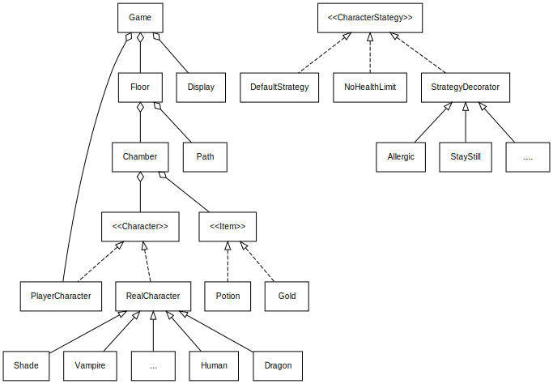
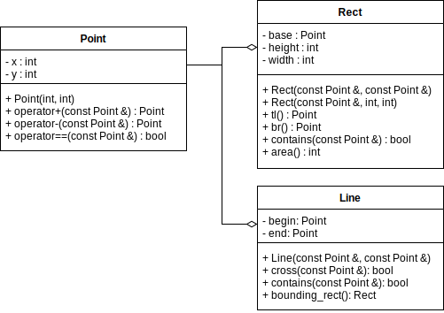

# 面向对象程序设计课程设计报告

## 一、总体设计

### 1. 本设计中类的UML结构图

程序中主要类型的简图：



主要类的构成顺序大致是这样如此：Types -> Item -> Characters -> Path & Chamber -> Floor -> Display -> Game

其中，`Display` 应该设为 `Character`, `Path`, `Chamber`, `Floor` 类的友元。

### 2. 系统设计说明

#### 2.1 整体分析

从面向对象的思想出发，首先对整个游戏进行分析，可以得出，游戏中主要有地图、房间、人物、物品若干元素，其中角色又可以分为主角和敌人、物品又分为黄金和药水。而游戏的过程，就是这些对象之间的交互（Interaction）。所以整个游戏的设计等于对象的设计和交互的设计。

因为游戏运行在字符界面的环境，从字符界面的特性出发，最容易想到的就是用连续的格子，也就是二维数组，来存储地形、人物等数据，在进行角色移动合法性等判断时符合直觉，即只需查询对应位置的信息即可，而且因为二维数组是连续的空间，直接就能索引得到数据，效率上也会比较高一些。

采用这样的思路，我们会发现，要实现这样的效果，格子包含的信息肯定不是单一的数据类型，它需要包含多种信息，比如当前位置的地形、格子是否被占用、被谁占用等等，因此我们需要设计一个结构，或者一个类，来实现“格子”的功能。

```cpp
class Cell {
    enum Terrain {WALL, FLOOR, EMPTY};
    Terrain terrain;
    /* ... */
};
```

但这种思路一旦一开始着手做，就会发现它并不是太好实现。这种方法在某种意义上可以理解成对游戏中各元素所做的一层包装，也就是提供对外的接口，然后再将信息转交给内部的对象进行处理。但这样有个问题，其实人物、物品可以算作性质不同的类，虽然可以将他们都视作对象Object，并由其派生而来，但是它们的接口毕竟还是会有很大的不同，这样`Cell`类在托管的过程中，还是会有些麻烦。

> 但是也确实有遇到这样的设计，其所有的角色和道具都是从`Cell`类派生出来的，从概念上来理解有点奇怪。

于是我们想到，可以用二维的`char`数组只存储地形数据，然后将角色、道具等类的实例另外集中存储，根据目的位置进行进一步操作：如果二维数组中存储的是代表角色或道具的字符，就去存储角色或道具的容器中**根据该处坐标寻找**对应的对象，并进行操作；如果存储的是代表地形的信息，则判断移动是否合法。

上面这种想法的思路应该比较清晰，实现起来应该也没有特别大的困扰。但其实它存在一个“双向链接”的问题，即角色的改变，要应用在地图上；在地图上的改变，也要应用在角色上；如果不细心忘记了更新地图上的信息，就会造成可能的错误出现。所以本设计没有采用这样“另外维护一个二维数组存储地图信息，并且依赖地图进行判断”的方式，而是只采用对象数组，角色的移动则通过遍历角色数组查询，而地形采用另外的数据结构存储。考虑到游戏中除了玩家外的角色不能离开房间，而每个房间内的角色数量并不庞大，因此遍历角色数组并不会带来很大的开销。

上文说到“地形采用另外的数据结构存储”。该设计中，我们将房间视作一个类`Chamber`，它可以拥有包括边界在内的一定属性，也负责托管角色等；而多个房间可以组成一个楼层`Floor`。采用`Rect`矩形类限定房间`Chamber`的边界，将其包含在房间类里面；通过调用`Rect`的`contains`方法判断点是否在矩形内，也就是判断是否在房间内；由于时间的原因，我们从简只用了一个`Rect`类，这样导致了我们的房间只能是矩形的，不过也有解决方案，就是使用多个矩形类限定边界，甚至可以构建一个新的地形类`Terrain`，并将其包含在`Chamber`内。

#### 2.2 各模块的设计

##### 2.2.1 基础类型

基础类型有`Point`、`Rect`、`Line`，分别表示“点”“矩形”“（有向）线段”三种类型。



##### 2.2.2 角色类和策略类

接下来谈论角色类的设计。最初我们想将角色分为`Hero`和`Enemy`两类，并从中派生出各个不同角色，分别实现他们的特色技能。但后来获悉了该游戏设计的背景，即将传统Rogue类游戏的正反派反转，从而形成了该游戏的设定，加之阅读了一些设计模式的内容（策略模式和装饰模式），我们的思想上升了一个高度，认为各个角色应当是平等的，不应该从一开始就决定了它们的正反派。因此我们定义了一个`Character`类，并从其派生出各个类别，对于玩家角色（`PlayerCharacter`，简称`PC`）则将其作为一个装饰类，可以“套”在任意一个角色的上，为他带来一些额外的特性。（但这大概也只是个权益之计，因为区分正反派只需要更改它们的“策略模式”就好了，这个会在后边介绍）

这样的话，角色的能力特长就被理解为一种内在的特质，而至于攻击的策略（比如命中率、是否攻击）等成为了外部因素。

我们认为，这样设计可以使设计过程更清楚，也使得游戏更易于扩展。为了增强游戏的可玩性，我们对角色的策略也做了升华：有些技能不应该只是被固化在角色身上的，而是可以做成通用的，根据角色需要，在使用时动态加载即可。

现有的游戏，只规定了若干种特殊技能，而且只有`atk`，`def`两个参数限定。由于类别少，可以采用从`Character`派生出各子类并覆盖定义更新的部分。但假设我们有n个子类，他们的技能可以概括为m种，其中 m < n，那么再为每个子类重新重载接受攻击或者药剂的实现则要写很多重复的代码，而且要更改和维护也是个麻烦事，所以在这里我们可以用策略模式解决这个问题。而其实策略模式本身就是继承派生的一个替代品。

我们将角色的策略与角色本身分离开，角色本身只留出一个接口，实际上攻击和被攻击以及使用药水等操作都交给内部包含的策略类来处理。

策略模式还有一个好处，就是我们可以在运行时切换人物的技能，比如某人物可以习得别的人物的技能。

我们还想更进一步，假如我们希望技能可以**叠加**，可以再对策略类进行装饰。我们把策略进一步拆解，可以分出如`PotionEnhance`药剂效果增强、`RestoreHealthbyAttack`攻击回复生命值等，将他们做成装饰类。在装饰模式下，所以这些类可以套在彼此之上，也就实现了效果的叠加，而且可以动态执行，也就是可以随着游戏的运行而改变。

这种设计下，每一层类负责处理传入或传出的数据，直接或对其加工之后之后转交给下一层再处理，直观理解可以想象成洋葱一般的一层层的结构。由于采用的是装饰模式，这可能会导致一些装饰的叠加之间有顺序要求，因此还可以使用工厂模式，根据指定的参数返回一系列策略出来。

当然，也可以采用线性的结构存储各个策略，每次按照次序依次处理我们的效果，这样的话不需要使用上述的装饰模式了，但是我们只实现了装饰模式，未对线性存储策略这种方式进行进一步的研究探讨和实现。


##### 2.2.3 显示输出

目前程序通过向控制台输出ASCII字符，从而显示出游戏界面。

根据前文的介绍，程序将显示与实际后台情况分离开，也就是说，程序不通过判断二维数组里面数据的情况来进行反应，而是遍历与元素的关系。程序每个房间是独立的，其中的元素数量有限，遍历它们不会造成时间上的过多增加。

这样做还能减少一些特性实现的复杂度，比如Dragon被消灭之前，其守护的Gold只是显示在屏幕上，只当其被消灭之后，Gold才会生成在指定位置。

事实上，程序在内部仍然具有一个二维数组，存储要输出的内容，可以理解为“显示缓冲区”。至于每一回合界面的更新，最初，我们想重绘变化的位置，但是有些细节之处不便实现，比如角色移动后需要重新复原它之前所在格子的信息，于是索性将房间设置为最小重绘单位。由于独立房间的设计，每次只需更新每个房间即可。

独立的房间还使得带权重或均衡物品生成变得易于实现（更能从抽象角度上理解），方便以易于人类阅读的方式保存存档（如果按照前文提到的，以每个单元格为一个对象进行设计，则将会有 $ 25\times79=1975 $ 个对象，不得不说很庞大），方便控制和更改每个房间的特性（比如可以选择不显示某些房间内的内容——“关灯模式”、随着玩家移动渐进式展开——“探索模式”）等。

##### 2.2.4 楼层和房间

该程序的一个重点在于如何识别出各个房间。按照现有的方法，是使用一个类，限定出房间的坐标；后来参考别人的代码发现，如果使用二维数组来存储地图，其实可以使用数字来表示不同的房间。

地图的层级如下所示：楼层（floor）> 房间（chamber）> 人物（character），亦即楼层包含若干房间，房间包含任务。

每次移动后将内容重新输出在终端上。


详细设计：

- 房间内可以考虑采用相对于房间的坐标记录人物角色位置（实际采用的是绝对坐标）

- 房间生成一个`neighbor`列表给角色（表示某一角色周边的人物），角色再对列表进行处理，并选择是否攻击、以及攻击优先级，


##### 2.2.5 数据表示和存档

实际还没有实现存档和读档功能。

可能的地图表示——采用配置文件的形式描述每一个房间的大小和位置、通道的形状和起始点。

```
chamber: 
point = (23,23) 
width = 16
height = 8
port1 = (x,y)
port2 = (x,y)
...

chamber:
point1 = (1,2)
point2 = (3,4)
port1 = (x,y)
port2 = (x,y)
...

path:
port1 = (x,y)
port2 = (x,y)
...
line1 = (x1,y1)(x2,y2)
line2 = (x1,y1)(x2,y2)
...

```


#### 2.3 文件目录层级

整个工程的目录文件树如下：

```
cc3k-villain
│  .gitignore
│  CMakeLists.txt
│  cover.txt
│  intro.txt
│  LICENSE
│  main.cc
│  README.md
│
├─basic
│  │  canvas.hpp  // Canvas: 用来实现将Point等基础图形“画”在二维数组上
│  │  effect.hpp  // Effect: 表示药剂效果的类
│  │  figures.hpp // Point, Rect, Line 类
│  │  status.hpp  // CStatus: 表示角色状态的类
│  │  types.hpp   // 包含以上4个头文件，使用时可以直接include
│  │
│  └─src
│          canvas.cc
│          figures.cc
│
├─characters
│  │  character_interface.hpp // Character: 角色类的接口，抽象虚基类
│  │  character.hpp           // RealCharacter: 从Character派生出来，为可以使用的角色实体
│  │  player_character.hpp    // PlayerCharacter: 装饰类
│  │  races.hpp               // 从RealCharacter派生出的各种角色，实际上是相当于为RealCharacter赋值
│  │  strategy_interface.hpp  // CharacterStrategy: 策略类接口
│  │  strategies.hpp          // 各种策略，包括基础策略类、策略类的装饰类接口和各种装饰策略类。
│  │
│  └─src
│          character.cc
│          player_character.cc
│          races.cc
│
├─control
│  │  display.hpp  // Display: 负责读取各类中的信息，集成canvas，负责一切输出
│  │  game.hpp     // Game: 游戏总控
│  │
│  └─src
│          display.cc
│          game.cc
│
├─facilities
│  │  chamber.hpp // Chamber: 房间
│  │  floor.hpp   // Floor: 楼层
│  │  path.hpp    // Path: 描述通道
│  │  port.hpp    // Port: 描述链接房间和通道的端口
│  │
│  └─src
│          chamber.cc
│          floor.cc
│          path.cc
│
└─items
    │  gold.hpp   // Gold: 黄金
    │  item.hpp   // Item: 物品抽象类接口
    │  potion.hpp // Potion: 药剂
    │
    └─src
            gold.cc
            potion.cc
```


## 二、实现的功能
> 说明：按照课程设计的要求详细写明自己实现了哪些功能

实现了大部分要求的功能。由于采用了不同存档的方式，又受限于时间，游戏中的地图还不能随机生成或者读取存档，是内置在程序里的。

## 三、软件使用说明

> 说明：有些同学设计的软件的使用不一定和我要求的一样，写明使用自己程序的命令。

角色前进的方向上如果有敌对角色，会自动攻击；如果是中立角色，则不进行移动；前进方向上有药剂将会被阻挡，有黄金则会自动拾取。其他的使用方式都类似。

## 四、编程过程中遇到的主要问题及学习总结
> 说明：可以挑选一个或几个本程序设计中的难点或者你认为自己设计的比较好的地方，说明自己如何实现了它们，以及学到了什么。

一开始的程序设计中，由于一开始没有很完善具体的规划，因此在代码编写的过程中经常会有接口变动，这增加了不少工作量。而且由于设计规划不清晰，也使得单模块的调试在其他模块完成之前几乎无法进行，同时也造成了代码主体完成后重复包含的问题，最后通过对整体代码结构进行分析、进而重整，才解决了问题，成功通过了编译，这之后才算能够进入调试和完善阶段。试想如果开工之前先设计规划好各个模块之间的层级关系以及相应接口，则能够更清晰高效的进行工作。

由于规划不善和使用了复杂的设计方式，这份工程事实上也花费了更多的时间。然而，目前程序只完成了主要功能，很多预想的功能没有时间实现，但是自我认为其有较大的扩展空间，比如得益于摆脱了用二维数组存储地图的设计，使得房间的叠加等成为可行；使用了策略模式和装饰模式，可以动态叠加或删除效果等。